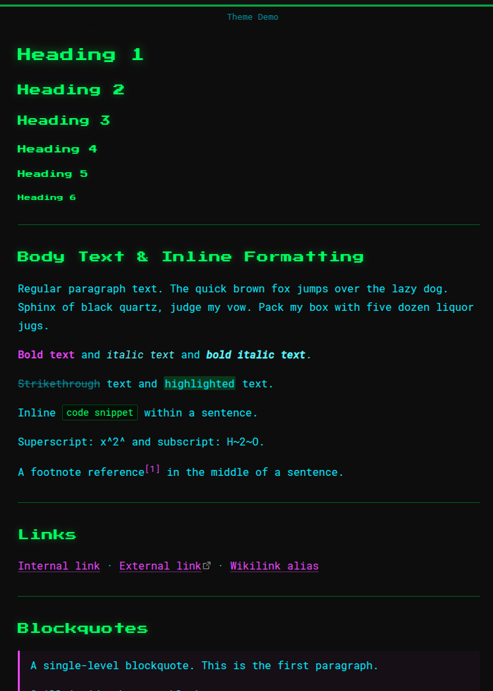

```
    ______         __           _     
   / ____/________/ /_  _______(_)____
  / __/ / ___/ __  / / / / ___/ / ___/
 / /___/ /__/ /_/ / /_/ (__  ) (__  ) 
/_____/\___/\__,_/\__, /____/_/____/  
                 /____/                    
```



A dark Obsidian theme with a retro-terminal aesthetic, built around neon color on near-black and a pixel-game typographic identity.

**Author:** [Kodama Chameleon](https://github.com/kodamaChameleon)

---

## Design

The theme takes its visual language from the terminal: monospace everywhere, neon green headers that glow against the dark, and a framed border effect that anchors each note like a screen inside a screen.

### Color palette

| Role | Color |
|---|---|
| Headings | `#33ff4b` — neon green |
| Body text | `#49eaff` — cyan |
| Accents, bold, links | `#df40fe` — magenta |
| Background | `#0d0d0d` — near-black |

### Typography

- **Headings** — [Press Start 2P](https://fonts.google.com/specimen/Press+Start+2P) (pixel/retro game font)
- **Body & UI** — [Roboto Mono](https://fonts.google.com/specimen/Roboto+Mono)

Both fonts are loaded from Google Fonts and require an internet connection on first load.

---

## Features

- **Terminal frame** — each note is bordered by a thin green line on all four sides. The top and bottom edges are solid; the left and right edges fade to transparent between 40%–60% of the pane height, dissolving into the background at the center.
- **Heading glow** — H1–H3 carry a soft neon `text-shadow` that steps down in intensity with each level.
- **Neon tables** — table borders use green at varying opacities; the header row has a full-opacity bottom border and a subtle green background tint.
- **Callout titles** — rendered in Press Start 2P at small size, consistent with the heading identity.
- **Colored inline formatting** — bold is magenta, italic is a brightened cyan, highlights are green-tinted.
- **Magenta links** — underlined by default with a dimmed underline color that brightens to full on hover.
- **Syntax highlighting** — code blocks use a near-black green-tinted background with green default text, magenta keywords, cyan strings, and yellow values.

---

## Installation

### Manual

1. Download or clone this repository.
2. Copy the `ecdysis/` folder into your vault's `.obsidian/themes/` directory.
3. In Obsidian: **Settings → Appearance → Themes** and select **ecdysis**.

### From the community theme browser

1. In Obsidian: **Settings → Appearance → Themes → Manage**
2. Search for **Ecdysis**
3. Click **Install and use**

---

## Compatibility

Requires Obsidian `1.0.0` or later. Tested in both **Live Preview** and **Reading View**.
